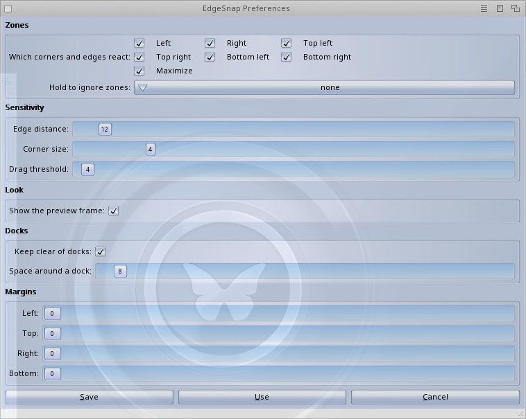

# EdgeSnap

**Author:** Michele Dipace <michele.dipace@kaffeine.net>
**License:** MIT (see [LICENSE](LICENSE))

Windows/macOS-style window snapping for AmigaOS 4.x and MorphOS: drag a
window against a screen edge or corner to tile it to a half or quarter of
the screen, with a divider to resize the tiled pair afterwards.

Written in C89. No system patches: a commodity input handler plus public
Intuition calls only. See [docs/DESIGN.md](docs/DESIGN.md) for the full
design and roadmap. The long-term target is an upstream-quality
`edgesnap.library` that can be adopted by both operating systems; the
commodity is the first client and reference implementation of that library,
not the product boundary.

## Product direction

EdgeSnap is being developed as shared window-management infrastructure for
MorphOS and AmigaOS 4.x, not as another hotkey-only window utility.

The product target is:

- a small, documented public library with a conservative, versioned API;
- one portable C89 engine for geometry, state, policies, and snap decisions;
- native MorphOS and AmigaOS 4 backends that respect each system's ABI and
  library conventions;
- a commodity/UI client providing drag-to-edge interaction, live preview,
  hotkeys, preferences, and Exchange integration;
- third-party clients able to request snapping, query state, exclude windows,
  and integrate the engine without copying its internals.

Every implementation choice should move the project toward a library that
could plausibly be reviewed and adopted by the maintainers of both systems.
The project must not claim official adoption before that review happens; it
must earn it through API quality, compatibility, documentation, and reliable
target-system behavior.

## Prior art

Window snapping is not new on the Amiga, and the closest and most
successful piece of prior art is **GoSnap**.

**GoSnap solves the classic AmigaOS 3.x case, and solves it well.** It
is the answer for that world, it is used, and EdgeSnap is not an
attempt to replace it or to improve on it there. Anyone on 3.x is
better served by GoSnap today.

**EdgeSnap is written for AmigaOS 4.x and MorphOS.** That is not a
detail of packaging: these systems bring compositing, ReAction and MUI,
docks and panels that must not be covered, screens of a size where
tiling actually pays off, and a commodity and library model EdgeSnap
leans on throughout. Aiming at them from the first line is what makes
the dock awareness, the live preview and the two native preferences
windows possible.

**And the goal is not only interactive snapping.** The product boundary
is `edgesnap.library`: a documented, versioned service that any program
can call to have windows placed, to ask where a zone is, or to find and
move the seam between two tiled windows. The commodity that ships with
it is a client of that library like any other would be. A window
utility ends at its own user interface; a shared service does not, and
that is the bet EdgeSnap is making.

Also worth naming for completeness: **ZapperNG** and **WinAction**,
which arrange windows from hotkeys. EdgeSnap keeps hotkeys too, but its
first gesture is the drag.

## Status



*The MorphOS preferences window (MUI), version 0.2. The AmigaOS 4 window is the same sections in ReAction: both are generated from one settings table.*

- **Phase 0 (spike): validated on BOTH targets** - AmigaOS 4 (QEMU,
  2026-08-11) and real MorphOS hardware (2026-08-26): drag detection,
  snapping and the outline preview all work, including the
  MorphOS-specific CxCustom gate.
- **Phase 1 (portable core): done.** The validated spike behavior lives
  as a portable, host-tested core: `core/engine.c` (drag/snap state
  machine), `core/registry.c` (stale-resistant snap registry + restore),
  `include/edgesnap_types.h` (zones, errors, capabilities). The draft
  public contract is `include/edgesnap.h`.
- **Phase 2 (reference commodity): ported.** `commodity/edgesnap_cx.c`
  now runs entirely on the core - the frontend feeds window facts and
  executes emitted actions, with zero snap logic of its own (one snap
  path shared by drag and hotkeys, the road ESnap_SnapWindow() will
  pave). Verified in-VM on OS4; the MorphOS binary builds from the same
  source. **Preferences** are in: `ENV(ARC):EdgeSnap.prefs` plus Shell
  arguments, parsed by the portable `core/config.c` (zones, edge/corner
  sensitivity, preview, dock detection and margin, own margins, bypass
  qualifier), and the native preferences windows - ReAction and MUI -
  are built from the same table.
- **Phase 4 (native integration): in progress.** The API surface now
  lives in `library/edgesnap_body.c` behind a semaphore - snap, unsnap,
  query, exclude, options, capabilities, plus the interactive path that
  samples windows, runs the engine and performs the snap. The commodity
  contributes only raw input facts and the drawing of the preview
  frame, and gets a report back to log (a library never prints).
  **The AmigaOS 4 library is real**: `library/os4/` builds
  `edgesnap.library` (ELF, manager + "main" interfaces, no C runtime),
  and `tools/esnaptest.c` - a client that knows nothing of EdgeSnap's
  internals - opens it from LIBS: and drives the whole API, including
  the error contract (a stale window answers ES_ERR_STALE, it does not
  crash). The **MorphOS skeleton** (`library/morphos/`) is written and
  builds - classic jump table, EmulLibEntry gates, `.fd` and
  `ppcinline/` stubs - and is **runtime-validated on the MorphOS QEMU
  VM**: the same third-party client opens it, runs the full sequence
  and gets the documented errors for misuse. Both skeletons are proven
  on their own system. **The commodity is now a client**: it opens
  edgesnap.library rather than linking it, through a documented
  frontend-integration group in the API (FeedInput / ResetInput /
  IgnoreWindows / QueryScreenArea). Frontend and library are two
  binaries, as in the finished product.

## The reference commodity

`commodity/edgesnap_cx.c` is the single-source commodity for both OSes,
born as the phase 0 spike that validated the two load-bearing
assumptions on real systems:

1. drag detection by correlating pointer movement with the active window's
   position under `LockIBase()` (no IDCMP access to foreign windows, no
   `SetFunction()` patches);
2. `ChangeWindowBox()` on a foreign window right after drag release.

What the spike does today:

- drag a window's title bar so the **pointer** touches a screen edge or
  corner: an outline frame previews where the window will land (four thin
  borderless windows - no compositing needed); release: the window snaps
  to half / quarter / usable-maximum;
- the divider: when two windows end up side by side, a thin handle
  appears on the seam - drag it and both resize, so half/half becomes
  60/40 without touching either window's size gadget (library side
  host-tested and proven in-VM; the drag itself awaits a hand on the
  mouse);
- dock awareness, macOS-style: AmiDock / Ambient panel strips are
  detected and reserved, so snapped windows never cover the dock;
- a **preferences window on each system**, installed in `SYS:Prefs/`
  where the rest of the system's preferences live: ReAction on
  AmigaOS 4, MUI on MorphOS, both built by walking the one table that
  describes the settings, so neither can offer a value the file parser
  would refuse. Save, Use and Cancel behave as they do everywhere else,
  and EdgeSnap picks the change up while running;
- the same settings from `ENV(ARC):EdgeSnap.prefs` or the command line,
  same vocabulary either way
  (`EdgeSnap ZONES=halves EDGEPX=24 BYPASSQUAL=alt`);
  the startup banner echoes the settings in force;
- hotkeys (no drag heuristics involved):
  `ctrl alt cursor left/right/up` = snap left / right / maximize,
  `ctrl alt cursor down` = restore pre-snap geometry;
- `EdgeSnap QUIT` stops a running instance from a Shell or a script -
  which is how an update replaces itself without a reboot; launching it
  twice by accident is simply refused, and the running one carries on;
- prints every decision to stdout: run it from a Shell, watch it think.

## Reading guide

Suggested order for studying the code:

1. [docs/DESIGN.md](docs/DESIGN.md) - the whole architecture, why a
   commodity + library, the input-handler rule, the roadmap, and the
   spike findings so far.
2. [core/zones.h](core/zones.h) / [core/zones.c](core/zones.c) - the pure
   C89 zone geometry, with [core/zones_test.c](core/zones_test.c) as its
   executable specification.
3. [commodity/edgesnap_cx.c](commodity/edgesnap_cx.c) top to bottom -
   the sections mirror the architecture: library bases and the
   OS4/MorphOS type differences; the shared handler/task state and the
   CxCustom action (with the MorphOS 68k-ABI gate); the non-blocking
   log; window snapshotting under LockIBase (dock-aware usable area);
   the one shared snap path over the core registry; the preview
   backends (MorphOS windows / OS4 strips over saved pixels / AROS
   XOR toward the accent); the
   core glue that feeds
   ESEngine and executes its actions; the commodity plumbing in main().

Key invariants to keep in mind while reading: the CxCustom action runs in
input.device context and only bumps counters + Signal()s; every Intuition
call lives in the main task; under LockIBase we only read, and a stored
struct Window * is never used without re-validation via the screen lists.

## Layout

- `core/` - pure C89, zero Amiga dependencies, unit-tested on the host:
  zone geometry, the drag/snap engine, the snap registry
- `include/` - public headers: portable constants (edgesnap_types.h) and
  the draft platform API contract (edgesnap.h)
- `library/` - edgesnap.library's body: the one implementation behind
  the public API (state, validation, snapping, the interactive path),
  wrapped by the platform skeletons and linked by the commodity
- `commodity/` - the reference commodity (OS4 + MorphOS from one
  source): raw input facts in, preview frame drawn, nothing decided
- `tools/` - `esnaptest`, a third-party client used to exercise the ABI
- `Makefile.host` / `Makefile.os4` / `Makefile.morphos` - commodity and
  host lanes; `Makefile.os4lib` builds edgesnap.library and
  `Makefile.os4tool` the test client
- `scripts/` - container build wrappers

## Installing it so it is simply always there

EdgeSnap is a commodity: a program that stays resident. The user never
starts it by hand - it is installed once and comes up with the system,
like every other commodity. From the release volume:

```text
Execute Install-EdgeSnap
```

That puts `edgesnap.library` in `LIBS:`, the commodity in `C:`, and one
line in `S:User-Startup`. From the next boot it is simply there:
dragging a window to a screen edge snaps it, and Exchange is where it
is enabled, disabled or removed.

`S:User-Startup` rather than `SYS:WBStartup` is a deliberate choice:
it needs no icon and works on installations that have no WBStartup
drawer at all - which the OS4 test machine turned out to be. Users who
prefer the Workbench route can drop `EdgeSnap` and `EdgeSnap.info`
into `SYS:WBStartup` instead; the icon carries the settings as
tooltypes, and the commodity reads them (and stays silent, since a
Workbench start has no console).

Verified on AmigaOS 4 in the VM: install, reboot, and the first drag
snapped with nothing started by hand.

## Build

Host tests (any C compiler):

```sh
make -f Makefile.host test
```

AmigaOS 4 and MorphOS (need `colima start`; toolchains live in
`../os4-cross` and `../morphos-cross`):

```sh
scripts/build-os4.sh
scripts/build-morphos.sh
```

Outputs: `build/os4/EdgeSnap`, `build/morphos/EdgeSnap`.

## Testing on the target systems

QEMU AmigaOS 4 VM: build an ISO and hot-swap it into the running VM's
CD drive, no network needed. The scripts default to the author's VM
directory; point them elsewhere with `ES_OS4_VMDIR` (and
`ES_MOS_VMDIR` for MorphOS):

```sh
scripts/make-test-iso.sh     # unique 16-char volume label each time
scripts/os4-cd.sh insert     # newest ISO into the running VM
scripts/os4-cd.sh eject
```

Then in an OS4 Shell (the ISO carries no Amiga protection bits, so the
`Protect +e` is required):

```text
Copy ES_#?:EdgeSnap RAM:
Protect RAM:EdgeSnap +e
RAM:EdgeSnap
```

Real hardware: http.server + wget as usual, same `Protect +e` after.

Try: drag windows to edges/corners, the hotkeys, Exchange (disable /
enable / remove), Ctrl-C to quit. Things to observe and report back into
the design doc:

- does drag detection fire reliably? false positives with apps that move
  their own windows?
- after an edge-drop, does the snapped geometry stick, or does Intuition's
  own drop handling overwrite it? (If it loses the race, the library phase
  needs a deferred commit via timer.device.)
- behavior with non-resizable windows, MUI windows, shells with size
  increments.

## Platform notes

- The CxCustom input handler runs in the input.device context: it only
  bumps counters and `Signal()`s the main task. All Intuition calls happen
  in the main task. Under `LockIBase()` we only read; the lock is dropped
  before any Intuition call.
- MorphOS: commodities custom actions are called through the 68k ABI, so
  the handler is wrapped in an `EmulLibEntry` gate; `-noixemul` is
  mandatory; the PPC stack is sized via `__stack` (the shell `Stack`
  command only sizes the 68k stack).
- AmigaOS 4: built with `__USE_INLINE__` and explicit `GetInterface()` for
  intuition and commodities.
